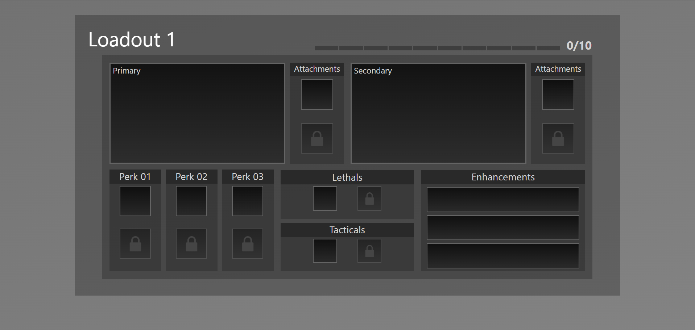
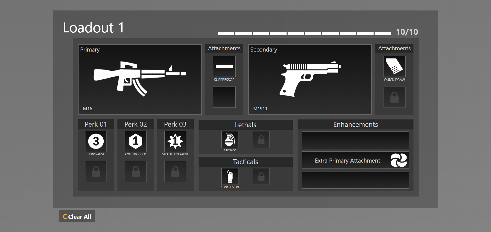
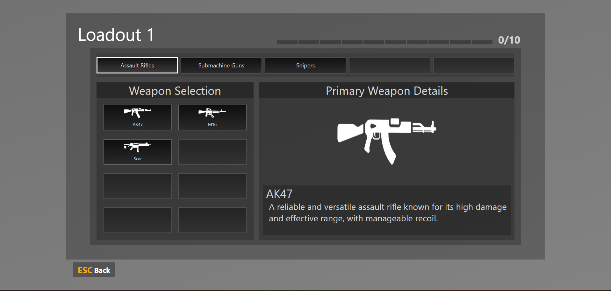
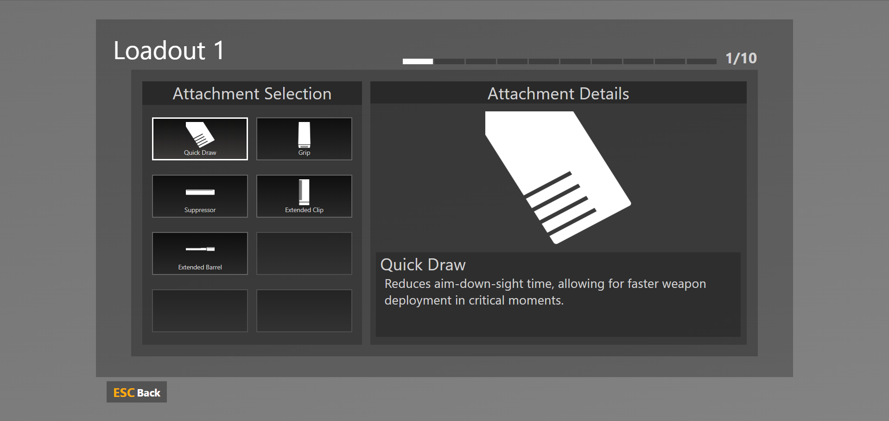
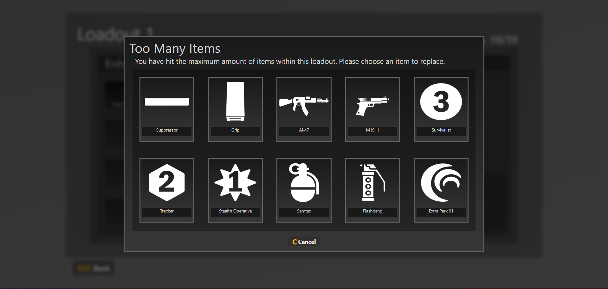

# Weapon Loadout System UI
This project is a Weapon Loadout System designed for games or applications that need a straightforward weapon loadout interface. It includes graphical assets, HTML structure, and TypeScript configurations to facilitate the creation and management of a weapon loadout. The system is inspired by the Call of Duty franchise.

## Preview

## Features
- **Responsive Design:**  Optimized for various screen sizes, ensuring a smooth experience for different screen sizes.
- **Item Descriptions:** Hover over items to view brief descriptions.

## Controls
1. **Keyboard Shortcuts**
   - **C:** Clear All items in Loadout.
   - **C:** Close replace item overlay.
   - **ESC:** Return to previous page.

2. **Mouse Interactions**
   - **Left-Click:** Select an slot/item.
   - **Right-Click:** Remove/Clear hovered slot.

## Setup Instructions
1. Extract the contents of the zip file.
2. Open `WeaponLoadoutSystem.html` in a web browser to preview the system.

## How to Use
1. Open the `WeaponLoadoutSystem.html` file in a web browser to view and interact with the inventory system.
2. Customize the assets by replacing images in the `assets/` folder.
3. Add or remove item data from `WeaponDetails.ts`

## Further Enhancements for Improvement
1. **Extra Leathal & Tacical:** Ensure this copies the already selected type and prevents the user from applying two different types.
2. **More Weapon Details:** Adding more area for details such as damage, range or other stats.
3. **Locking Attachments:** Locking attachment selection for certain weapons that may not be compatible with attachments.
4. **Selected State:** Displaying new styles on items that are already selected within the selection menus.

## Assets Used
[FlatIcon](https://www.flaticon.com/)

---

Feel free to expand or modify the weapon loadout system to suit your specific needs!
